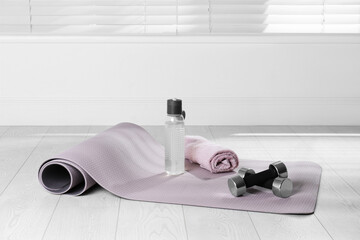

# Can Bellabeat Stay Ahead in the Wellness Tech Game?

## A Google Data Analytics Professional Certificate Capstone Project

|                                     |                                                 |
|:------------------------------------|-------------------------------------------------|
[Bellabeat](https://bellabeat.com/) high-tech manufacturer of health-focused products for women. Their products include smart water bottles, fitness watches and jewelry as well as yoga mats. Users can have access to their health data which is collected through the devices in the Bellabeat app. The founders of Bellabeat would like to analyse data from non-Bellabeat fitness devices to find out how consumers are using these products. With the insights from the analysis, the company hopes to develop new marketing strategies for the company. | 

# Ask

Business Task
Reveal more opportunities for growth (through advertising therefore sales) for Bellabeat by identifying trends in how consumers use non-Bellabeat smart devices.

Stakeholders
1. Executive Team - cofounders Urska Srsen and sando Mur
2. Marketing team
3. Analytics team

## Bellabeat Products

Bellabeat app: The app provides users with health data related to their sleep, activity, stress levels, menstrual cycle, and mindfulness habits. The app can be connected to other devices to give optimal efficiency. With this data, users can know and understand better their habits, activity levels and how they can improve certain areas of their lives. The Bellabeat app connects to their line of smart wellness products.

Leaf: The Bellabeat’s classic wellness tracker can be worn as a bracelet or necklace. The Leaf tracker connects to the Bellabeat app to track activity, sleep, and stress.

Time: This wellness watch combines smart technology to track user activity, sleep, and stress. The Time watch connects to the Bellabeat app to provide users with insights into their daily wellness.

Spring: The unique water bottle tracks daily water intake using smart technology to ensure that users are consuming enough water throughout the day. The Spring bottle connects to the Bellabeat app to track their hydration levels.

Bellabeat membership: Additionally, Bellabeat offers a subscription-based membership program for users. Membership gives users 24/7 access to fully personalized guidance on nutrition, activity, sleep, health and beauty, and mindfulness based on their lifestyle and goals.

## Key Questions
1. What are some trends in smart devide usage?
2. How could these trends apply to Bellabeat customers?
3. How can these trends influence the Bellabeat Marketing Strategy?
   

