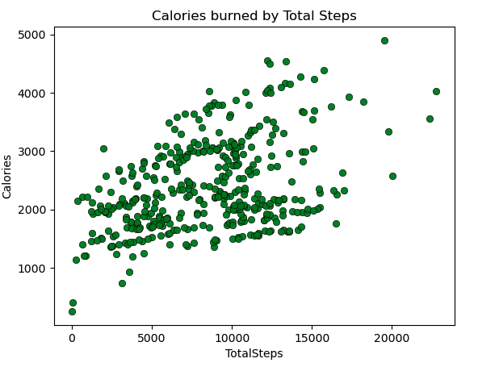

# Can Bellabeat Stay Ahead in the Wellness Tech Game?

## A Google Data Analytics Professional Certificate Capstone Project


|                                     |                                                 |
|:------------------------------------|-------------------------------------------------|
[Bellabeat](https://bellabeat.com/) high-tech manufacturer of health-focused products for women. Their products include smart water bottles, fitness watches and jewelry as well as yoga mats. Users can have access to their health data which is collected through the devices in the Bellabeat app. The founders of Bellabeat would like to analyse data from non-Bellabeat fitness devices to find out how consumers are using these products. With the insights from the analysis, the company hopes to develop new marketing strategies for the company. | 


# Ask

Business Task
Reveal more opportunities for growth (through advertising therefore sales) for Bellabeat by identifying trends in how consumers use non-Bellabeat smart devices.

Stakeholders
1. Executive Team - cofounders Urska Srsen and sando Mur
2. Marketing team
3. Analytics team

## Bellabeat Products

Bellabeat app: The app provides users with health data related to their sleep, activity, stress levels, menstrual cycle, and mindfulness habits. The app can be connected to other devices to give optimal efficiency. With this data, users can know and understand better their habits, activity levels and how they can improve certain areas of their lives. The Bellabeat app connects to their line of smart wellness products.

Leaf: The Bellabeat’s classic wellness tracker can be worn as a bracelet or necklace. The Leaf tracker connects to the Bellabeat app to track activity, sleep, and stress.

Time: This wellness watch combines smart technology to track user activity, sleep, and stress. The Time watch connects to the Bellabeat app to provide users with insights into their daily wellness.

Spring: The unique water bottle tracks daily water intake using smart technology to ensure that users are consuming enough water throughout the day. The Spring bottle connects to the Bellabeat app to track their hydration levels.

Bellabeat membership: Additionally, Bellabeat offers a subscription-based membership program for users. Membership gives users 24/7 access to fully personalized guidance on nutrition, activity, sleep, health and beauty, and mindfulness based on their lifestyle and goals.

## Key Questions
1. What are some trends in smart devide usage?
2. How could these trends apply to Bellabeat customers?
3. How can these trends influence the Bellabeat Marketing Strategy?
   
# Prepare

## Data Governance Protocols

The dataset used in this analysis was generated through a distributed survey via Amazon Mechanical Turk between 03.12.2016-05.12.2016. Thirty eligible Fitbit users consented to the submission of personal tracker data, including minute-level output for physical activity, heart rate, and sleep monitoring. The dataset is stored in Kaggle as  and available through Mobius.

- The data was obtained through informed consent from participants regarding the purpose and use of their data.
- Anonymized or pseudonymized personally identifiable information to protect privacy.
- Ensured compliance with relevant regulations and ethical considerations throughout the data collection process.
   - Trustworthiness of the Source: Google provided the Google Data Analytics certificate, indicating credibility and adherence to data privacy and security standards.
   - Trustworthiness of the Platform: The dataset is hosted on Kaggle, a reputable platform known for its commitment to data privacy and security.
- Transparency and Openness: Organizations that are transparent about their processes are more likely to have implemented robust data security measures.

## Addressing Data Quality Limitations

- The sample size of the data is small, only 30 individuals were considered
- The data is several years old, which may not accurately reflect the current state of Fitbit devices, given the rapid evolution of technology since the data was collected.
- The weight-related data is limited to just 8 participants. Furthermore, several entries in the data fields are missing, and a significant portion of the weight data was manually inputted
- Data collected via surveys may lack accuracy, as participants might not always provide truthful responses

# Process

## Applications
Excel is used to load the data, Python to transform and explore the data and Tableau to interactively visualise the data. 

## Choosing Data Files

`dailyActivity_merged.csv` file contains most of the data including the summary of the steps and calories burned while the `sleepDay_merged.csv` file provides sleep data. The two files are ideal to analyze the participants usage. Additional files such as the `dailyCalories_merged.csv` and the `weightLogInfo_merged.csv` will also be used to give additional data from device usage. 

## Data Preprocessing Steps for Initial Analysis

import libraries to setup environment and import datasets

1. Convert data type for 'ActivityDate' column to a datetime data type
2. The `weightLogInfo_merged` file contains a 'Fat' field/column which contains missing values therefore this will not be used to draw insights
3. Ensure that there are no blank entries int he data using filters

## Transform and Explore Data

The final dataframe contains 940 daily activities recorded, 940 daily calories entries recorded, 413 daily sleep data recorded, 22099 hourly steps data recorded and 65 NaN values in the weightloginfo_data. All Python code can be found [here](Bellabeat_Project.ipynb) 

1. previewing and summaring datasets
2. rename  ActivityDatem SleepDay and Date to convert to date data type
3. remove duplicates
4. Merging datasets

```
daily_activity_data['ActivityDate'] = pd.to_datetime(daily_activity_data['ActivityDate'])
daily_activity_data.rename(columns={'ActivityDate': 'Date'}, inplace=True)
daily_activity_data.info()

```
sleepday_data.duplicated().sum()


# Analyze

## Summary statistics of the Data and visualisation


### Correlation between total steps taken and calories burned



A positive correlation between the steps taken by users and the calories burned. This implies that the more steps taken the more calories are burned.


### Steps taken throughout the week


The steps taken on Sundays are averaging lower than on other days. We can deduce that perhaps sundays are days when most users feel less need to be active and on Monday the daily steps increase quite significantly and follow through as such through the week reaching very high daily steps on Tuesdays and Saturdays

### Total time asleep by Day of the Week

We can also see that users slept longer on Wednesdays and Mondays as well probably due to the start of the week and the middle of the week. This could also be representative of users being less active or taking more steps on these days as well.


### Sedentary vs Active Users


This observation underscores that the majority of users tend to allocate more time to less active pursuits. Several factors may contribute to this discrepancy. 

### Calories Burned by Day of the Week


The higher calorie burn on Saturday is expected as we've seen in our "Steps taken throughout the Week" plot as it is the weekend and more people have more time for physical activities

# Share

# Act
## Recommendations

Based on the analyses done on the users of the fitbit devices, the following recommendations can be put forth to the stakeholders.

1. Seeing as there is a positive correlation between the steps users take and the calories they burn, users may need an incentive to continue taking more steps or even increase their daily steps. This could come from offering rewards, challenges, and/or curating personalised achievements by way of notifications or badges that users can see to encourage users to want to reach their target goals.

2. Users seem to spend most of the time awake in bed before falling asleep. This can affect a person's activity the next day. Notifications can be sent to users to alert them of their sleep time or sleep schedule once they've built one. By doing so, users will equate the notification to time to sleep.

3. The steps taken average around 7,500 daily besides on Sundays which the steps are quite low. Users can be encouraged to set a daily step target by sending them notifications or setting off alarms when their daily steps have not reached a particular number at a particular time of the day. This can motivate users to want to move around in order to reach the daily step target goal.

4. Throught further research, we can find out based on the varying activity levels of users for example very active users can be provided further metrics and information that they can review in order to continue or increase their daily activity such as information about meals, diets, intense workouts, intense challenges, competitions and so on. While the 'less active' users can be provided information that is motivating for instance personal health goals, information about walking events, challenges, walking buddies, walking clubs etc in order to get to be at the 'very active' activity level
